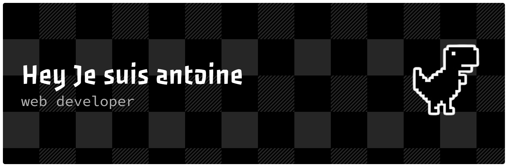

# 👋 Salut, moi c’est Antoine Jeanny

🎯 Développeur Web passionné par la performance, l’intuitivité et l’expérience utilisateur.  
💼 Fondateur de [JWebDigital](https://creationsjny.hopto.org/) – création de sites web pour particuliers et petites entreprises.  
🧪 Explorateur du web interactif, entre animations 3D et interfaces fluides.

---

## 🚀 Projets phares

- 🔧 [JWebDigital](https://creationsjny.hopto.org/) – Micro-entreprise spécialisée dans la création de sites web sur mesure.
- 🧬 Laboratoire Créatif – Expérience interactive 3D pour démontrer mes compétences en animation et design.
- 📦 [BladeFarming](https://github.com/BladeEver00/BladeFarming) – Automatisation agricole intelligente.
- 🤖 [HAGRA-bot](https://github.com/BladeEver00/HAGRA-bot) – Bot officiel pour l’équipe Hagra.

---

## 🧠 Compétences

### Front-End
- React • Next.js • TypeScript  
- Three.js • GSAP • HTML/CSS

### Back-End
- PHP • Express.js  
- REST APIs • GraphQL

### Outils
- Git • Docker • Figma • Vercel

---

## 📈 Stats GitHub

![Top Langs]github-readme-stats-gcsw45grq-antoines-projects-e18866bc.vercel.app/api/top-langs?username=BladeEver00&layout=compact&theme=radical)

---

## 📬 Me contacter

📧 jeanny.antoine@gmail.com  
🌐 [www.jwebdigital.com](https://creationsjny.hopto.org/)  
🔗 [LinkedIn](https://www.linkedin.com) • [GitHub](https://github.com/BladeEver00)

---

> “Créer, c’est traduire une idée en expérience. Le code est mon langage, le web mon terrain de jeu.”  
> — Antoine Jeanny
